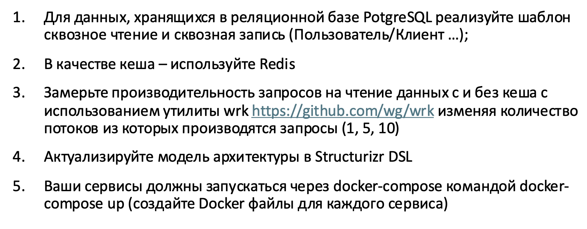

# Лабораторные работы по предмету Программная Инженерия (Системный Дизайн)

---

## Описание

###### Группа: М80-109-СВ
###### Исполнитель: Гимазетдинов Дмитрий
###### Варинат: 10

---

Лабораторные работы по системному дизайну направлены на то, чтобы реализовать поэтапно микросервисы, с использованием современных технологий: REST, PostgreSQL, Mongo, Redis.

---

# Лабораторная работа №1

> Status: Process

> Директория: [/Lab1_system_design](./Lab1_system_design/)

> Отчет: [/Lab1_system_design/src/README.md](./Lab1_system_design/src/README.md)

> DSL: [/Lab1_system_design/src/Worlspace.dsl](./Lab1_system_design/src/Worlspace.dsl) 

#### Задание

---

# Лабораторная работа №2

> Status: Process

> Директория: [/Lab2_REST_with_in_memory](./Lab2_REST_with_in_memory/)

> Отчет: [/Lab2_REST_with_in_memory/README.MD](./Lab2_REST_with_in_memory/README.MD)

> OpenAPI: [/Lab2_REST_with_in_memory/doc/OpenAPI/](./Lab2_REST_with_in_memory/doc/OpenAPI/)

> DSL: [/Lab2_REST_with_in_memory/doc/Worlspace.dsl](./Lab2_REST_with_in_memory/doc/Worlspace.dsl) 

#### Задание

---

# Лабораторная работа №3

> Status: Process

> Директория: [/Lab3_REST_with_postgresql](./Lab3_REST_with_postgresql/)

> Отчет: [/Lab3_REST_with_postgresql/README.md](./Lab3_REST_with_postgresql/README.md)

> OpenAPI: [/Lab3_REST_with_postgresql/doc/OpenAPI/](./Lab3_REST_with_postgresql/doc/OpenAPI/)

> DSL: [/Lab3_REST_with_postgresql/doc/Worlspace.dsl](./Lab3_REST_with_postgresql/doc/Worlspace.dsl) 

#### Задание

---

# Лабораторная работа №4

> Status: Process

> Директория: [/Lab4_REST_postgresql_mongo](./Lab4_REST_postgresql_mongo/)

> Отчет: [/Lab4_REST_postgresql_mongo/README.md](./Lab4_REST_postgresql_mongo/README.md)

> OpenAPI: [/Lab4_REST_postgresql_mongo/doc/OpenAPI/](./Lab4_REST_postgresql_mongo/doc/OpenAPI/)

> DSL: [/Lab4_REST_postgresql_mongo/doc/Worlspace.dsl](./Lab4_REST_postgresql_mongo/doc/Worlspace.dsl) 

#### Задание

---

# Лабораторная работа №5

> Status: Process

> Директория: [./Lab5_REST_postgresql_mongo_redis/](./Lab5_REST_postgresql_mongo_redis/)

> Отчет: [/Lab5_REST_postgresql_mongo_redis/README.md](./Lab5_REST_postgresql_mongo_redis/README.md)

> OpenAPI: [/Lab5_REST_postgresql_mongo_redis/doc/OpenAPI/](./Lab5_REST_postgresql_mongo_redis/doc/OpenAPI/)

> DSL: [/Lab5_REST_postgresql_mongo_redis/doc/Worlspace.dsl](./Lab5_REST_postgresql_mongo_redis/doc/Worlspace.dsl) 

#### Задание

---

# Файлы с заданиями

- [system_design_task_01.pdf](./materials/tasks/system_design_task_01.pdf)
- [system_design_task_02.pdf](./materials/tasks/system_design_task_02.pdf)
- [system_design_task_03.pdf](./materials/tasks/system_design_task_03.pdf)
- [system_design_task_04.pdf](./materials/tasks/system_design_task_04.pdf)
- [5 задание в конце презентации](./materials/tasks/arch_lection_11_cache.pdf)