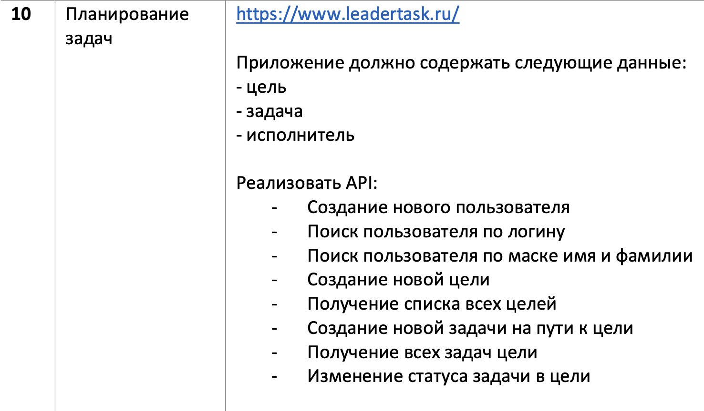
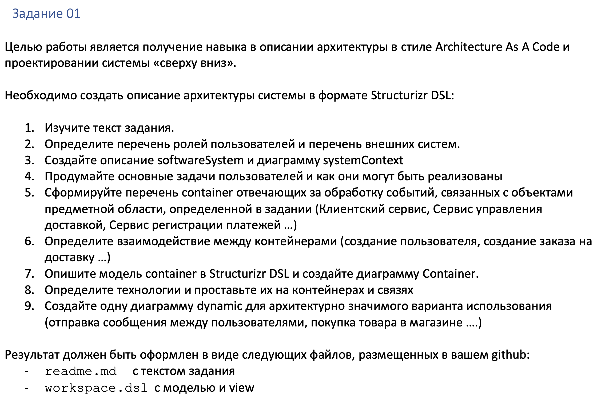
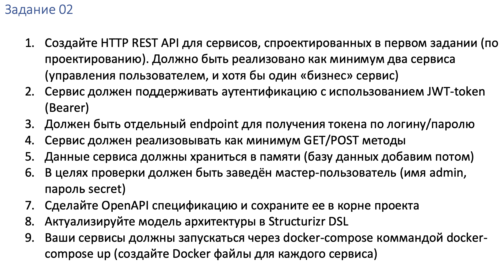
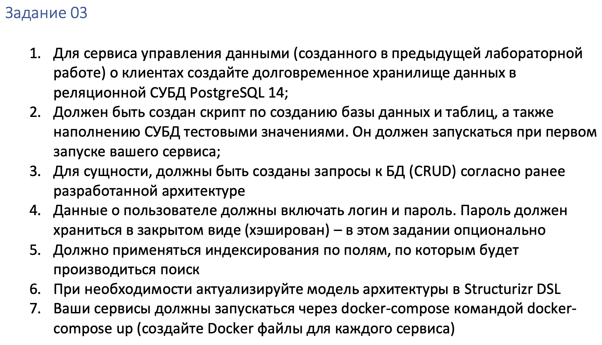
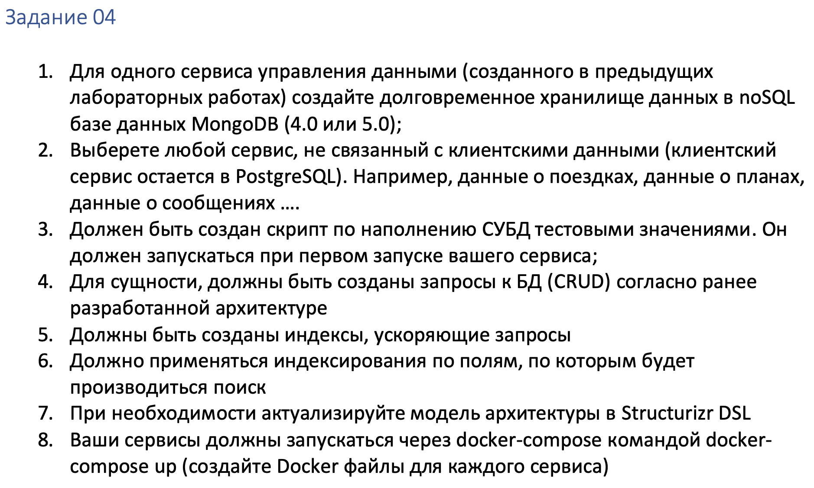

# Лабораторные работы по предмету Программная Инженерия (Системный Дизайн)

## Описание

###### Группа: М80-109-СВ
###### Исполнитель: Гимазетдинов Дмитрий
###### Варинат: 10

Лабораторные работы по системному дизайну направлены на то, чтобы реализовать поэтапно микросервисы, с использованием современных технологий: REST, PostgreSQL, Mongo, Redis.

---

# Лабораторная работа №1

> Директория:

> Отчет: 

> Swagger: 

#### Задание

---

# Лабораторная работа №2

> Директория: [/Lab2_REST_with_in_memory](./Lab2_REST_with_in_memory/)

> Отчет: [/Lab2_REST_with_in_memory/README.MD](./Lab2_REST_with_in_memory/README.MD)

> Swagger: 

#### Задание

---

# Лабораторная работа №3

> Директория: [/Lab3_REST_with_postgresql](./Lab3_REST_with_postgresql/)

> Отчет: [/Lab3_REST_with_postgresql/README.md](./Lab3_REST_with_postgresql/README.md)

> Swagger: 

#### Задание

---

# Лабораторная работа №4

> Директория:

> Отчет: 

> Swagger: 

#### Задание

---

# Лабораторная работа №5

> Директория:

> Отчет: 

> Swagger: 

#### Задание

---

# Файлы с заданиями

- [system_design_task_01.pdf](./materials/tasks/system_design_task_01.pdf)
- [system_design_task_02.pdf](./materials/tasks/system_design_task_02.pdf)
- [system_design_task_03.pdf](./materials/tasks/system_design_task_03.pdf)
- [system_design_task_04.pdf](./materials/tasks/system_design_task_04.pdf)